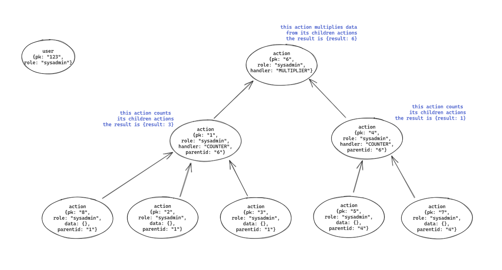

# Dynamic calculations

In this directory you will find application for dynamic calculations. Database contains two type of elements: `users` and `actions`. Every `user` has a `role` in the system. Every action contains either a handler type or some data attached and a role required to perform action.

Every `action` with handler performs some calculation based on its child actions (the result from child calculation or a data attached). For example `COUNTER` action returns amount of its child nodes and `MULTIPLIER` action multiplies all of its child action results.

## Your tasks

1. In `src/authorize.js` write authorization logic. There are four roles with following hierarchy: `SYS_ADMIN` > `LOCAL_ADMIN` > `ENTERPRISE_USER` > `BASIC_USER`, which means that only users with `SYS_ADMIN` role can request calculation from `action` with this role required and every user can request calculation from `action` with `BASIC_USER` role. The authorization only happens at requested action level. Child action roles are not taken into consideration.

<table>
  <tr>
    <td>user \ action</td>
    <td>SYS_ADMIN</td>
    <td>LOCAL_ADMIN</td>
    <td>ENTERPRISE_USER</td>
    <td>BASIC_USER</td>
  </tr>
  <tr>
    <td>SYS_ADMIN</td>
    <td>✅</td>
    <td>✅</td>
    <td>✅</td>
    <td>✅</td>
  </tr>
  <tr>
    <td>LOCAL_ADMIN</td>
    <td>❌</td>
    <td>✅</td>
    <td>✅</td>
    <td>✅</td>
  </tr>
  <tr>
    <td>ENTERPRISE_USER</td>
    <td>❌</td>
    <td>❌</td>
    <td>✅</td>
    <td>✅</td>
  </tr>
  <tr>
    <td>BASIC_USER</td>
    <td>❌</td>
    <td>❌</td>
    <td>❌</td>
    <td>✅</td>
  </tr>
</table>

2. In `src/handlers/` create file with `Newest` handler, which will return item with most recent timestamp. There is already one handler created in `src/handlers/counter.js` that you can use as a template.
3. In `src/calculate.js` create function that will fetch all necessary actions (the one requested by user and all child actions) and perform calculations in correct order. You can assume that all the outputs from child actions are valid inputs for parent action. The function can use recursion to handle child calculations.
4. Make all tests in `tests/` passing. You can also create additional test cases.
If you feel it's necessary you can add additional files or modify existing code.
